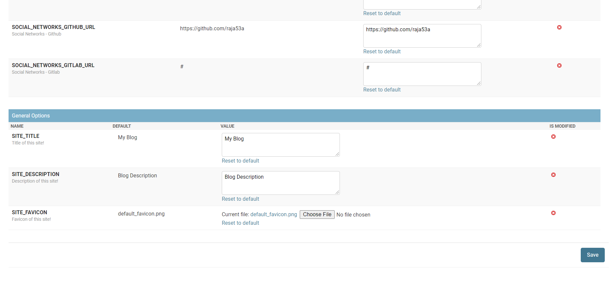

An example of Django project with basic user functionality.

## Live
[MyBlog](https://code-myblog.herokuapp.com/)

## Screenshots

| Landing Page | Blog Page | Footer |
| -------|--------------|-----------------|
|  |  |  |
| Blog Page | Admin Page | Site Details |
|  |  |  |

## Functionality

- Menu
    - Homepage
    - Blog
    - Blog Categories
    - Videocast
    - Videocast Categories
    - Podcast
    - Podcast Categories
 - Stylish Side Nav-bar
 - Smart Search Bar
 - Admin Panel


## Installing

### Clone the project

```
git clone https://github.com/raja53a/Blog-Django.git
cd Blog-Django
```

### Install dependencies & activate virtualenv

```
pip install pipenv

pip install -r requirements.txt

```
### Apply migrations

```
python manage.py makemigrations
python manage.py migrate
```
### Running

#### A development server

Just run this command:

```
python manage.py runserver
```
